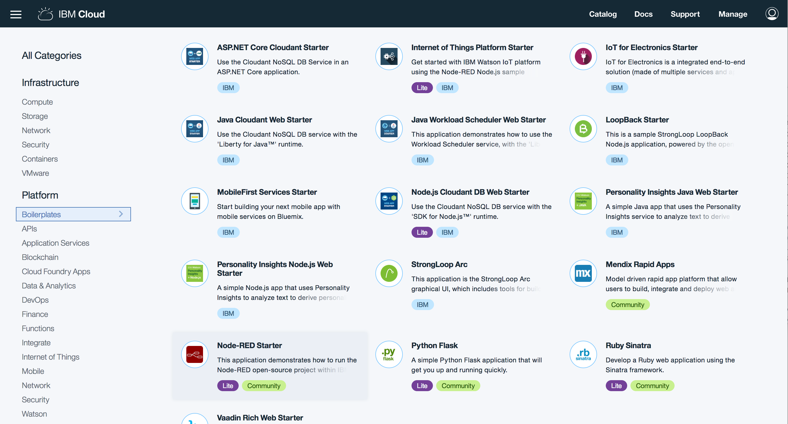
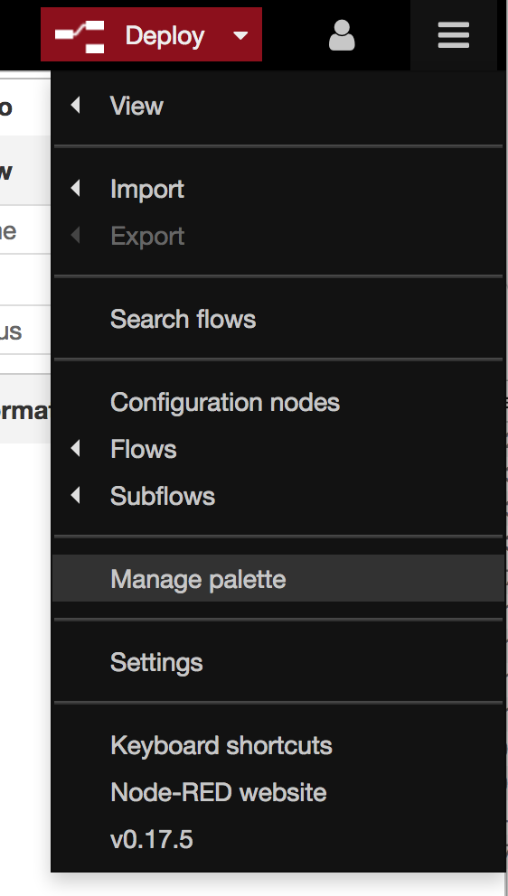
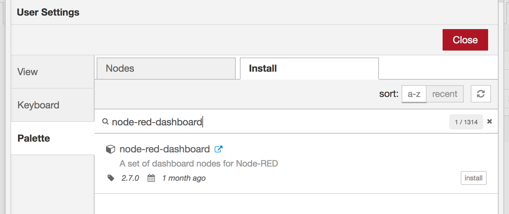
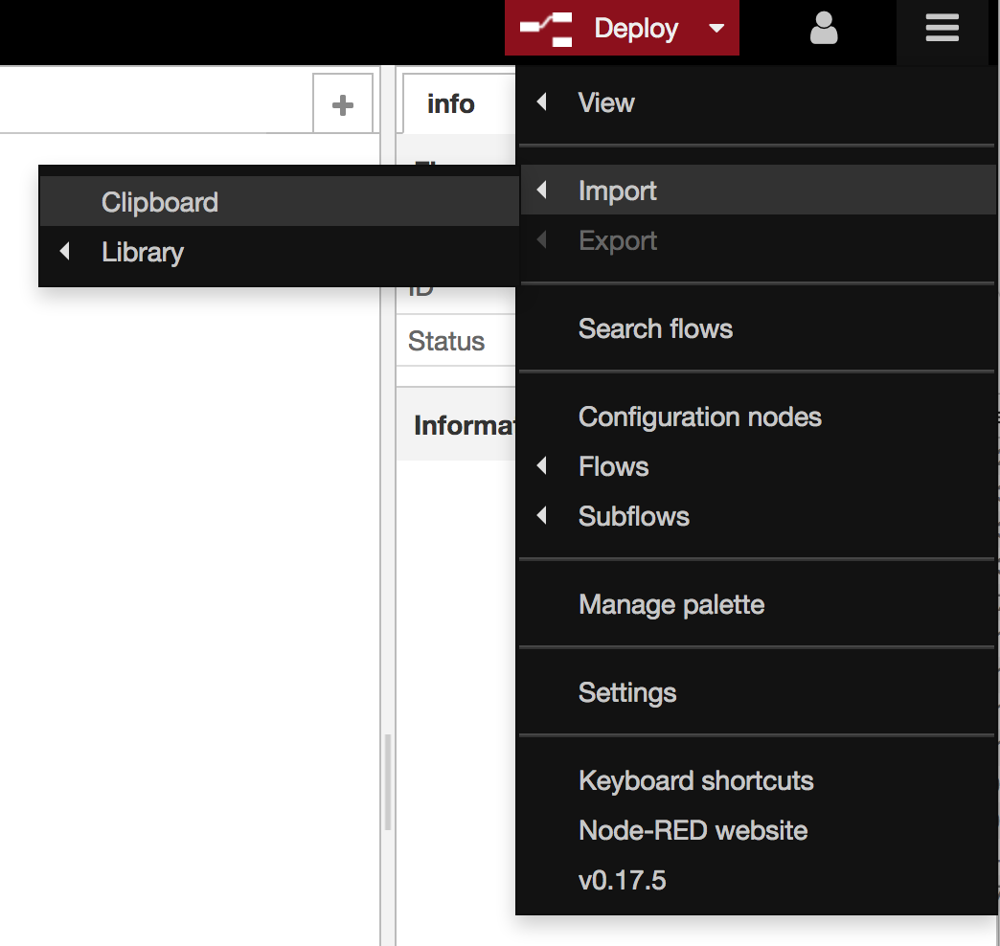
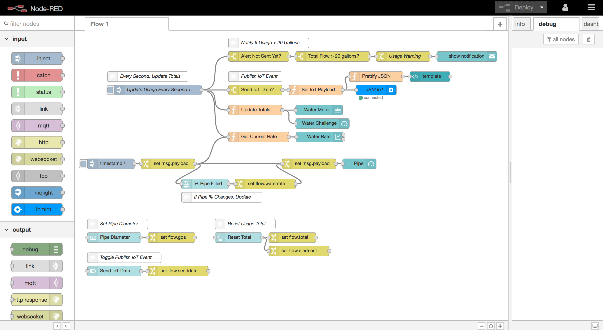
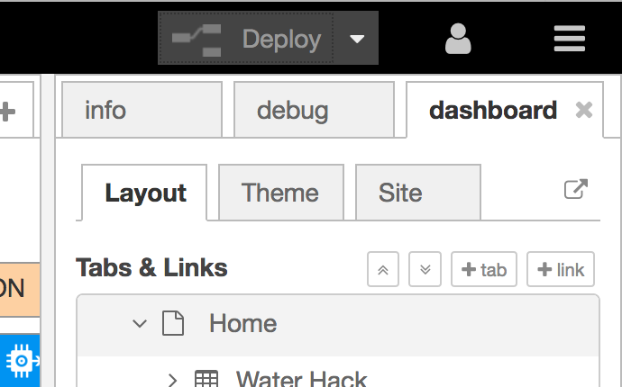
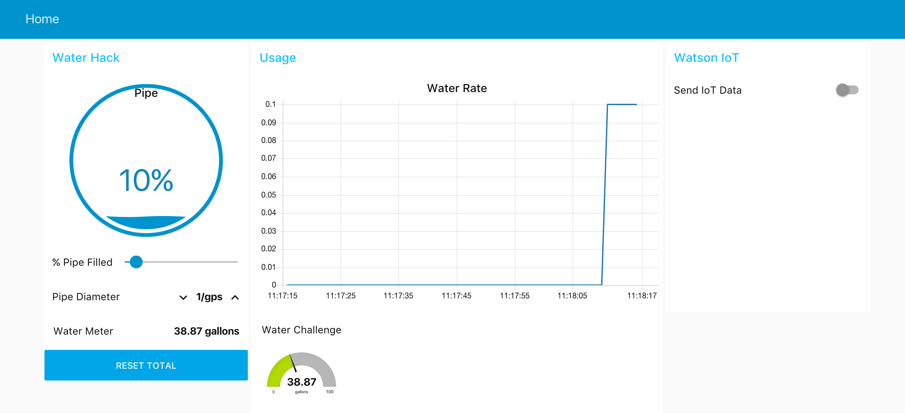
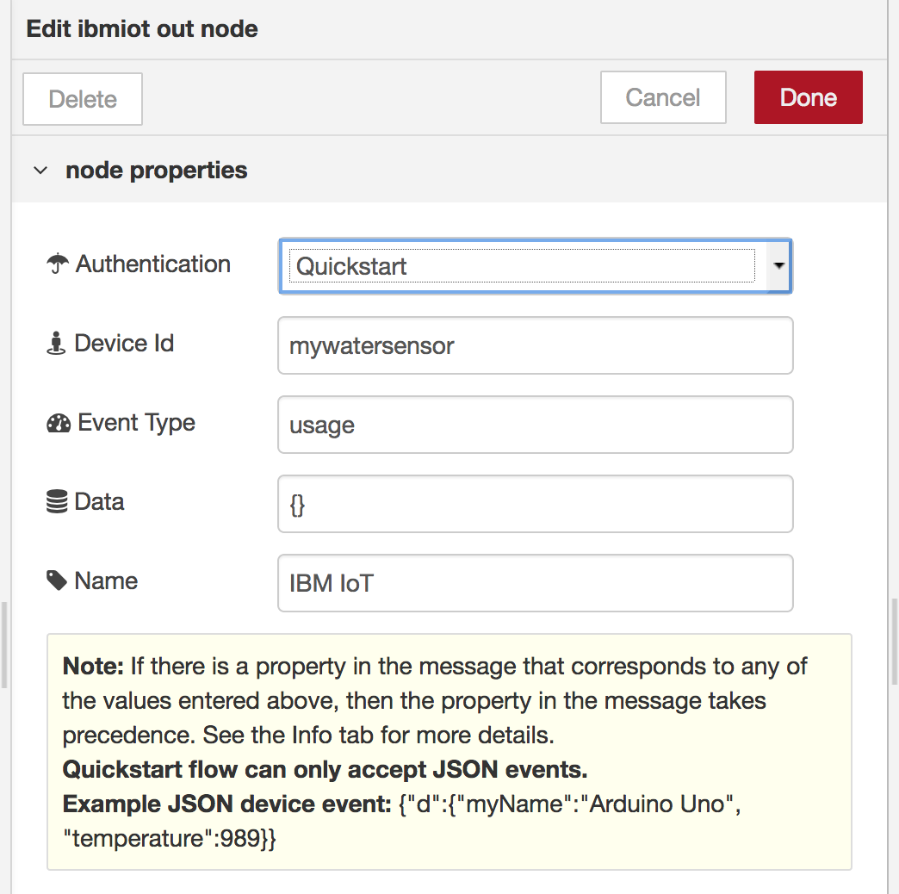
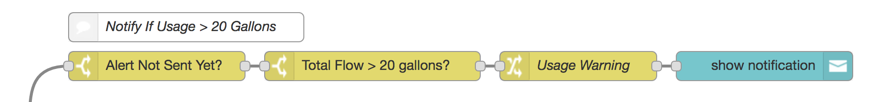

# Water Pipe Simulator in Node-RED

This Node-RED flow simulates a water pipe with an adjustable pipe capacity and percentage filled. It calculates amount of water usage per second and can publish an IoT event to the Watson IoT Platform for further analysis.

## Getting Started

Node-RED is required, with the `node-red-dashboard` nodes installed. You can run Node-RED locally or in IBM Cloud. Create a **Node-RED Starter** boilerplate application if you choose to run it in IBM Cloud.

Install the `node-red-dashboard` node package by clicking on the menu in Node-RED -> **Manage Palette**.

Search for `node-red-dashboard`. Click **install** to install the nodes.

## Import Flow

The completed flow is available in [code/flow.json](code/flow.json). Import the JSON by clicking on the menu in the Node-RED -> Import -> Clipboard. Paste the JSON into the textbox.

The completed Node-RED flow should appear as shown.

## Access Node-RED Dashboard UI

To access the Node-RED dashboard, click on the dashboard tab in the right sidebar, and click on the arrow to the right of the tabs. Alternatively, append `/ui` to the end of the Node-RED host. 

Begin by increasing the pipe diameter (the rate at which the pipe will transfer the water per second when completely full). Slide the slider across to adjust the percentage of the pipe that is filled. Every second, the amount of water useed will be updated. The chart will also display the historical rate.

## Publish IoT Event

To publish IoT events to the Watson IoT Platform with the current usage, return to Node-RED and edit the IoT node. Specify an IoT device ID.

Return to the dashboard and toggle the switch next to **Send IoT Data**. You can then subscribe to these events in the Watson IoT Platform or another application.

## Usage Notifications

The flow titled `Notify If Usage > 20 Gallons` monitors total water usage and if it meets the specified threshold, will display a notification in the UI. You can connect this flow to other nodes, such as Twilio or Twitter, to send external notifications. This exercise is left for the reader.

## License

This code is licensed under Apache 2.0. Full license text is available in [LICENSE](LICENSE).
